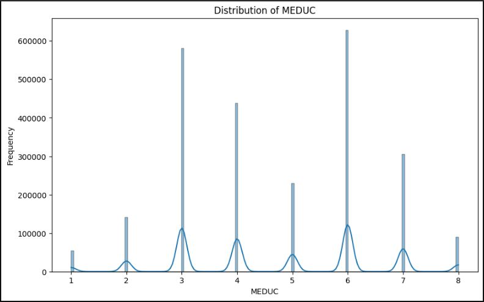
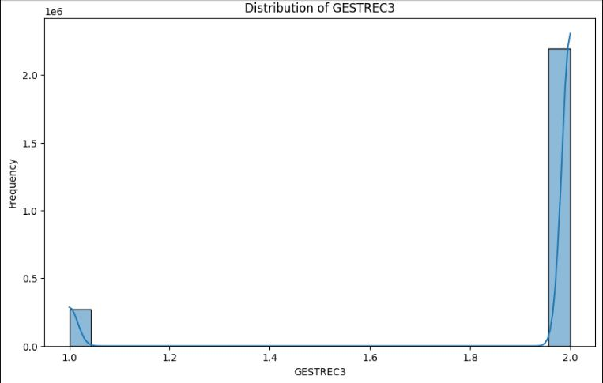
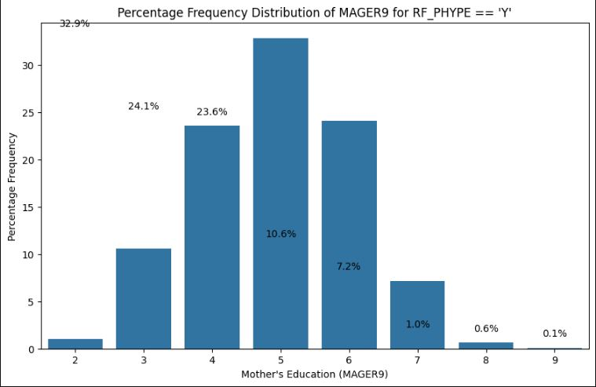
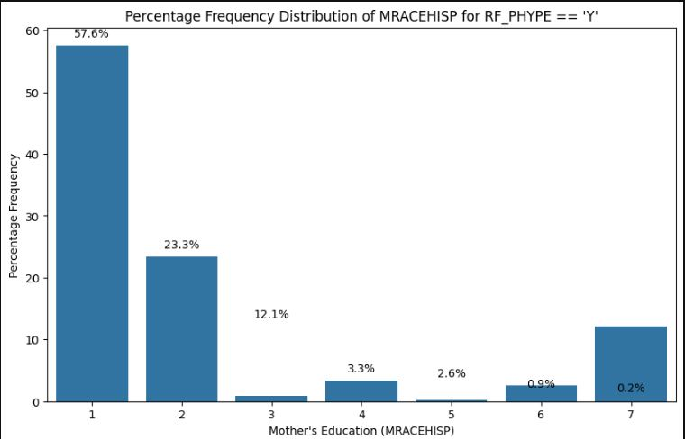

# Hypertensive-Disorders-in-Pregnancy

## Overview

This project dives into the critical issue of hypertensive disorders of pregnancy (HDP), a leading cause of maternal and fetal complications, by analyzing trends across racial groups in the United States. Using a comprehensive dataset (combine_2022.csv), this notebook conducts exploratory data analysis (EDA) to uncover patterns, identify risk factors, and highlight disparities that can inform targeted healthcare interventions. Our goal is to empower policymakers, healthcare providers, and researchers with data-driven insights to reduce maternal health inequities and improve outcomes for mothers and babies.

## Why This Matters
Hypertensive disorders of pregnancy, including preeclampsia and gestational hypertension, affect 5-10% of pregnancies in the U.S. and disproportionately impact certain racial groups, contributing to maternal mortality and morbidity. By analyzing factors like maternal age, BMI, smoking habits, and prenatal care across races, this project aims to:

•	Identify high-risk groups for targeted interventions.

•	Highlight disparities in healthcare access and outcomes.

•	Provide a foundation for predictive models to prevent HDP complications.

•	Support equitable maternal healthcare policies.
This work is a step toward saving lives and reducing health inequities by turning data into actionable insights.

## Dataset Overview

The dataset (combine_2022.csv) contains 1,048,575 records of pregnancy-related data, with 19 columns capturing maternal and pregnancy characteristics. Key variables include:

•	MRACEHISP: Maternal race/Hispanic origin (to analyze racial disparities).

•	MAGER9: Maternal age group (risk factor for HDP).

•	BMI_R: BMI category (linked to hypertension risk).

•	PRECARE: Month prenatal care began (indicator of healthcare access).

•	CIG_0, CIG1_R, CIG2_R, CIG3_R: Smoking before/during pregnancy (potential risk factor).

•	MEDUC: Maternal education level (proxy for socioeconomic status).

•	PAY_REC: Payment source for delivery (reflects insurance access).

•	GESTREC3: Gestational age category (affects HDP outcomes).

•	FRACE15, DMAR, PRIORLIVE, PRIORDEAD, PRIORTERM: Additional demographic and pregnancy history variables.

The dataset is a powerful tool to explore how these factors correlate with HDP across racial groups, though the specific HDP variable is not yet defined in the code.

## What the Code Does

This notebook lays the groundwork for real-world impact through:

1.	Library Imports: Uses pandas and numpy for data manipulation, matplotlib and seaborn for visualization, and scikit-learn for future predictive modeling.

2.	Data Loading: Imports combine_2022.csv into a pandas DataFrame.

3.	Descriptive Statistics: Summarizes numerical variables to understand distributions (e.g., maternal age, BMI).

4.	Outlier Detection: Identifies outliers using the Interquartile Range (IQR) method to flag data quality issues.

5.	Duplicate Detection: Finds 1,340,439 duplicate rows, highlighting a critical data cleaning need.

6.	Missing Values: Attempts a missing values heatmap (failed due to an error) to assess data completeness.

7.	Data Export: Saves the processed DataFrame to combined_data.csv for further analysis.

Commented-out sections indicate plans for imputing missing values and encoding categorical variables, setting the stage for machine learning to predict HDP risk.

| |  | 
|--------------|---------------|

## Key Findings

•	Dataset Scale: 1,048,575 records provide a robust sample to study HDP trends.

•	Descriptive Insights:

o	Maternal age (MAGER9) averages around 4.61 (categorical scale), suggesting a diverse age range.

o	Low smoking prevalence (CIG_0, CIG1_R, etc., means < 0.1) indicates smoking may not be a primary HDP driver in this dataset.

o	Most deliveries occur in hospitals (BFACIL3 mean ≈ 1.03), but payment sources (PAY_REC) vary, hinting at insurance disparities.

•	Outliers:

o	High outlier counts in PRECARE (287,169), GESTREC3 (271,715), and FRACE15 (200,507) suggest potential data entry issues or natural variability in prenatal care and gestation.

o	No outliers in MRACEHISP, DMAR, MEDUC, or BMI_R, indicating consistent coding for these variables.

•	Duplicates: 1,340,439 duplicate rows (exceeding dataset size) point to a data processing error or duplicate entries, requiring urgent cleaning.

•	Missing Values: The heatmap code failed, so missing data extent is unclear, but this is critical for reliable analysis.

| |  | 
|--------------|---------------|

## Real-World Impact & Recommendations

This project can transform maternal healthcare by identifying at-risk populations and informing equitable interventions. To maximize impact:

1.	Clean the Data:

o	Duplicates: The 1,340,439 duplicates suggest a data error (e.g., multiple dataset concatenations). Use combined_df.drop_duplicates(inplace=True) and verify the dataset source to ensure unique records.

o	Missing Values: Fix the heatmap code (ensure combined_df is defined) and impute missing values (e.g., median for numerical, mode for categorical) to enable robust analysis.

2.	Define HDP Variable: Identify or create a binary column for HDP presence to analyze its prevalence by race (MRACEHISP). This is critical for studying disparities.

3.	Enhance Visualizations:

o	Plot HDP rates by race to highlight disparities.

o	Visualize prenatal care access (PRECARE) by race to identify gaps in healthcare delivery.

o	Use correlation heatmaps to explore relationships between BMI_R, MAGER9, and HDP.

4.	Build Predictive Models: Leverage scikit-learn libraries (already imported) to predict HDP risk using features like BMI_R, PRECARE, and MRACEHISP. Models like Random Forest or Logistic Regression can identify high-risk groups for early intervention.

5.	Address Disparities: Use findings to advocate for targeted prenatal care programs, especially for racial groups with higher HDP rates or lower PRECARE values.

6.	Validate Outliers: High outlier counts in PRECARE and GESTREC3 may reflect coding errors or real variability. Consult domain experts to confirm and handle appropriately.

7.	Engage Stakeholders: Share results with healthcare providers, policymakers, and community organizations to drive policy changes, such as improved prenatal screening for at-risk groups.

8.	Expand the Analysis: Incorporate time-series data (if available) to track HDP trends over years and assess interventions’ effectiveness.

By implementing these steps, this project can directly contribute to reducing maternal mortality and improving health equity.

## Contributing

Join us in making a difference in maternal health! To contribute:

1.	Fork the repository.

2.	Create a branch (git checkout -b feature-branch).

3.	Add features, fix bugs, or improve documentation (git commit -m "Add HDP prediction model").

4.	Push changes (git push origin feature-branch).

5.	Submit a pull request.

Please include clear comments and follow PEP 8 standards. We welcome contributions to enhance visualizations, modeling, or data cleaning.

## License

This project is licensed under the MIT License. See the LICENSE file for details.

